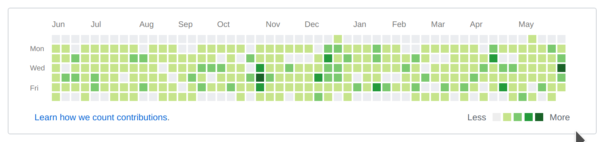

:slot_machine: node-committer
====  

A node.js script to green all github activity blocks.

一个用来生成 git commit 提交记录的 node.js 脚本，用来填满 github 绿色小方块。

Before

After :sparkles: :sparkles: :sparkles:

# Usage

TODO ...
